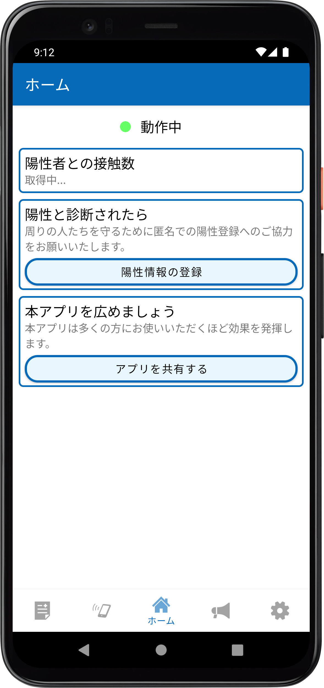
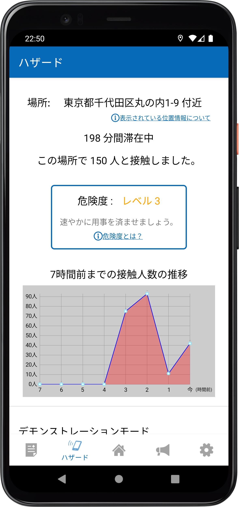
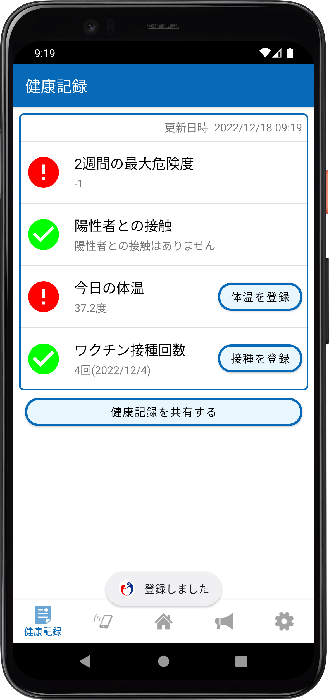
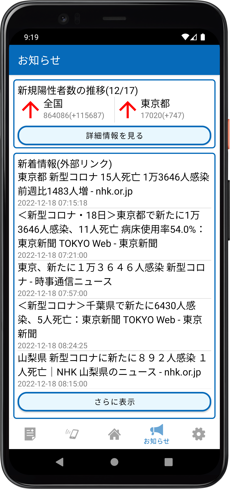
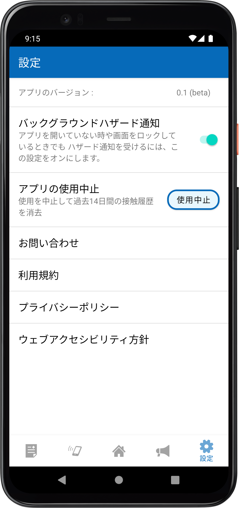
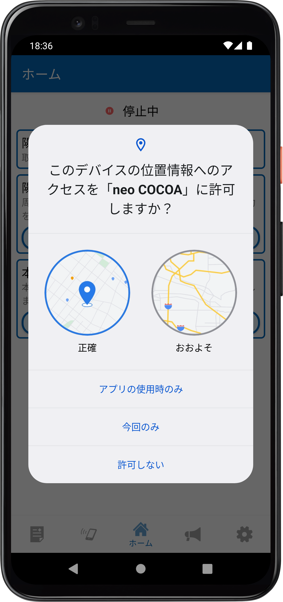
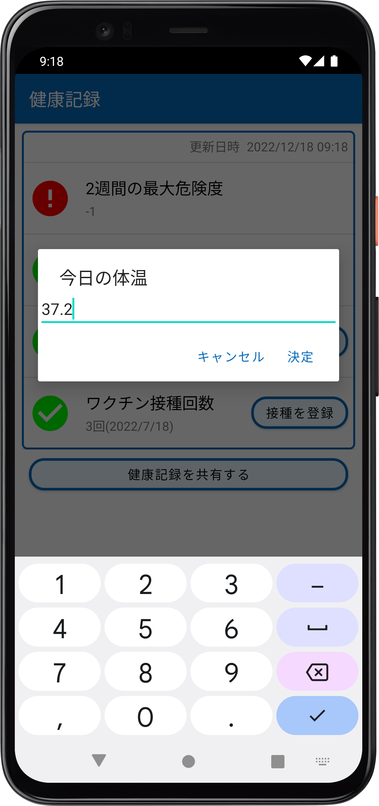
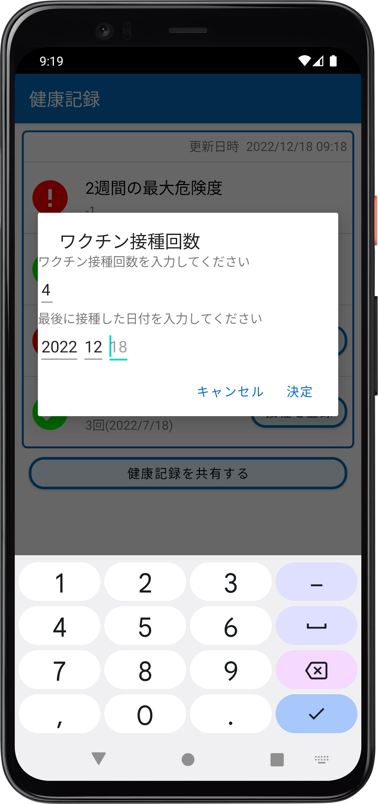

# neo COCOA
**接触確認アプリCOCOAの改善版のプロトタイプを実装するリポジトリです。**  
COCOAの問題点を分析し、改善策を考案したのちにプロトタイプとしてAndroidアプリを開発しました。

研究発表会で展示したポスターについては[こちら](neoCOCOA_ResearchPresentation_poster.pdf)をご覧ください。

--------------------------------------------------------------------------

   
   

--------------------------------------------------------------------------

## 提案機能
- ハザード機能
- 健康記録・証明書機能
- ニュース機能

## ハザード機能
接触確認APIとGPSを使用することで動作します。本家COCOAとは違い、陽性者陰性者の区別なく利用者に存在する人数を表示することで、人混み度合いによって自主的に感染予防のための行動を促すことを目的としています。

1. 接触確認APIを使用して、利用者周囲のBluetooth電波が届く範囲内のスマートフォンの台数をカウントする。
2. 検知した台数から感染危険度を判定し、利用者に通知する。  
   感染危険度の詳細については[研究発表ポスター](neoCOCOA_ResearchPresentation_poster.pdf)左下`表1`をご参照ください。
3. 台数カウント数はGPSを用いて、利用者が15m移動する毎に0にリセットされる。  
    -> アプリのハザード画面上には常に半径15m以内でカウントされたスマートフォンの台数が表示される。
4. カウントした台数は1時間ごとに保存しておき、7時間前までの接触人数の推移をグラフで表示することで利用者の一日の行動の振り返りに活用してもらう。

## 健康記録・証明書機能
利用者の体温やワクチン接種記録などを記録します。

加えてハザード機能で収集したデータを基に、過去2週間以内にどれほどの人混みに行ったかを表示します。

飲食店などで客に一定の基準を求めることで、店でのクラスター発生を予防することができます。

## ニュース機能
コロナウイルス感染者数を全国と現在地の都道府県ごとに表示します。前日比の表示機能と矢印によって増減を視覚的に分かりやすくしました。

またコロナウイルス関連のニュースをまとめて表示する機能を搭載することで、感染症関連の情報をこのアプリ1つですべて得られるようにしています。

## 今後の展望
全体として、プライバシーを考慮して機能を考案しましたが、感染危険度によって人を区別することになるため批判は免れないという問題点があります。

ハザード機能については単に人数を表示するだけでは、利用者に新しい気づきを与えることができないため別の機能と連携するなどして存在価値を高める必要があります。

健康記録・証明書機能については、スマートフォン標準搭載の健康記録アプリと連携することで、利用者の手入力による曖昧さを解消する必要があります。

ニュース機能についてはハザード機能など情報をもとに利用者各人に最適化された情報を提示することで、一般的なニュースアプリとの差別化をはかる必要があります。